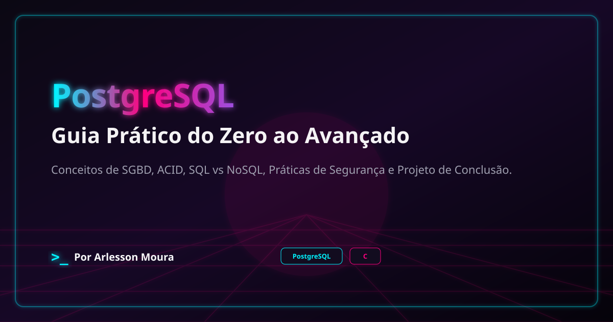

# PG//GUIA — PostgreSQL: Guia Prático do Zero ao Avançado

  

Este projeto nasceu de uma ideia simples e poderosa: transformar o PostgreSQL em
algo acessível, profundo e emocionante para quem quer aprender de verdade.

Não é apenas um repositório com anotações. É um manual de estudos pensado para
levar você do primeiro contato com bancos relacionais até o domínio de conceitos
avançados como transações, MVCC, índices, JSONB, triggers, performance e
arquitetura de sistemas multi-tenant.

A proposta aqui é clara: aprender PostgreSQL com rigor técnico, sem perder a
curiosidade, a prática e a boa didática. Cada módulo foi estruturado para ajudar
você a entender não só o "como", mas também o "porquê" por trás das decisões de
projeto e das melhores práticas de banco de dados.

## O que você vai encontrar

- fundamentos de bancos de dados e modelagem relacional
- SQL do básico ao avançado
- controle de integridade e normalização
- consultas complexas, joins e subconsultas
- transações, isolamento e consistência
- funções, triggers e PL/pgSQL
- performance, índices e otimização
- JSONB, views, materialized views e uso real em aplicações
- integração com C e conceitos de aplicações robustas

## Por que este manual importa

PostgreSQL é uma das ferramentas mais relevantes da engenharia de software moderna:
robusta, extensível, poderosa e usada em produção em sistemas de diferentes
escalas e complexidades. Aprender a usá-lo com maestria não é apenas um bônus
técnico — é uma vantagem estratégica para quem trabalha com dados, APIs,
aplicações web, arquitetura de software e desenvolvimento backend.

Aqui, o foco é ir além de comandos soltos. O objetivo é construir uma mentalidade
clara sobre:

- como os dados são armazenados e recuperados
- como garantir consistência e integridade
- como escrever consultas eficientes
- como escalar aplicações sem sacrificar confiabilidade
- como pensar como um profissional que entende banco de dados como parte central do sistema

## Uma jornada prática e envolvente

O conteúdo foi organizado em módulos pensados para evoluir gradualmente. Você
começa pela base — o que é um banco de dados, como o PostgreSQL se encaixa no
contexto da tecnologia e por que a modelagem relacional ainda é tão importante —
e depois avança para blocos cada vez mais profundos e aplicados.

A ideia é que a leitura seja didática, mas não superficial. Há espaço para teoria,
exemplos práticos, cenários reais e referências que ajudam a construir um raciocínio
sólido sobre PostgreSQL em contexto profissional.

## Uma proposta de estudo com identidade própria

Este projeto tem um estilo próprio: visual marcante, abordagem técnica séria e
linguagem que busca tornar a aprendizagem mais viva e inspiradora. O material foi
pensado para ser consumido em sequência, com profundidade, mas também com uma
energia que destaca a importância de dominar uma das ferramentas mais poderosas do
ecossistema open source.

Se você quer evoluir como desenvolvedor, analista, engenheiro backend ou
especialista em dados, este manual é um caminho para entender PostgreSQL como uma
ferramenta de excelência, não apenas como mais uma tecnologia a ser aprendida por
necessidade.

## O coração do projeto

O coração deste manual é simples: transformar estudo em prática, teoria em
habilidade e curiosidade em domínio.

Porque aprender PostgreSQL não é apenas memorizar comandos. É entender como os
dados fluem, como o sistema protege a consistência, como otimizar o que parece
pequeno e como construir soluções mais confiáveis e escaláveis.

Seja você iniciante ou alguém que já toca em SQL e quer ir além, este guia foi
concebido para te levar a um nível mais consciente, estratégico e técnico da
engenharia de dados e desenvolvimento com PostgreSQL.
